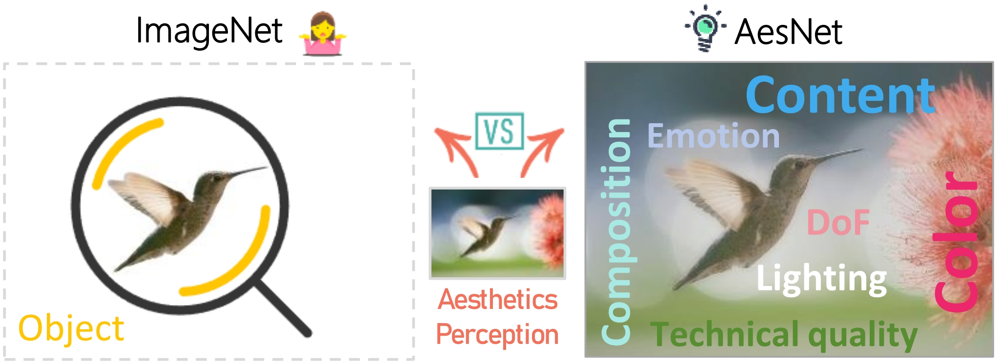

<h1>AesNet </h1>

_Make the visual basic model have stronger aesthetic computing capabilities. Try it now!_

 <div>
    <a href="https://github.com/yipoh/AesNet"></a>
    <a href="https://ieeexplore.ieee.org/document/10746353"></a>
    <a href="https://github.com/yipoh/AesNet"></a>
    <a href="https://pan.baidu.com/s/14LjC3Vfneg8bZT4-51rM_g?pwd=aesa"></a>

   </div>


   <h5> If you like this work, please give us a star ⭐ on GitHub.  </h2>


<h1>Introduction</h1> 
</div>

 <br>

</h5>
</p> 
<p align="center">
    
<p>
    <p align="justify">In the Image Aesthetics Computing (IAC) field, most prior methods leveraged the off-the-shelf backbones pre-trained on the large-scale ImageNet database. While these pre-trained backbones have achieved notable success, they often overemphasize object-level semantics and fail to capture the high-level concepts of image aesthetics, which may only achieve suboptimal performances. To tackle this long-neglected problem, we propose a multi-modality multi-attribute contrastive pre-training framework, targeting at constructing an alternative to ImageNet-based pre-training for IAC. Specifically, the proposed framework consists of two main aspects. (1) We build a multi-attribute image description database with human feedback, leveraging the competent image understanding capability of the multi-modality large language model to generate rich aesthetic descriptions. (2) To better adapt models to aesthetic computing tasks, we integrate the image-based visual features with the attribute-based text features, and map the integrated features into different embedding spaces, based on which the multi-attribute contrastive learning is proposed for obtaining more comprehensive aesthetic representation. To alleviate the distribution shift encountered when transitioning from the general visual domain to the aesthetic domain, we further propose a semantic affinity loss to restrain the content information and enhance model generalization. Extensive experiments demonstrate that the proposed framework sets new state-of-the-arts for IAC tasks.</p>

<h1>Pretraining Dataset</h1>
</div>

- <strong>Download Images<strong>

     <a href="https://pan.baidu.com/s/1RPIVhLAgif9CC6Abl1uXYQ?pwd=aesa"></a>
     
     <a href="https://huggingface.co/datasets/YiPo/AesNet_HAND/tree/main"></a>

- <strong>Download Multi-Attribute Descriptions<strong>

  - Based on [ShareGPT4V](https://github.com/ShareGPT4Omni/ShareGPT4V) (with _Human Double Check_)
    
    <a href="https://pan.baidu.com/s/1DLezrlN0pr0xwCZDCgFa1Q?pwd=aesa "></a>

    <a href="https://huggingface.co/datasets/YiPo/AesNet_HAND/tree/main"></a>

  - Based on [MiniCPM](https://github.com/OpenBMB/MiniCPM) (More advanced MLLM)
    
    Coming soon.

<h1>Code</h1>
</div>
Coming soon.

## Citation

If you find our work interesting, please feel free to cite our paper:

```bibtex
@article{AesNet,
  author={Huang, Yipo and Li, Leida and Chen, Pengfei and Wu, Haoning and Lin, Weisi and Shi, Guangming},
  journal={IEEE Transactions on Pattern Analysis and Machine Intelligence}, 
  title={Multi-Modality Multi-Attribute Contrastive Pre-Training for Image Aesthetics Computing}, 
  year={2025},
  volume={47},
  number={2},
  pages={1205-1218},
  doi={10.1109/TPAMI.2024.3492259}}
```


